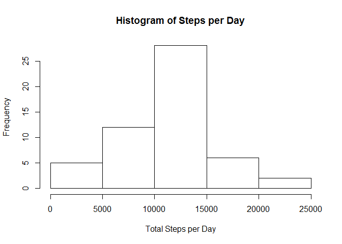
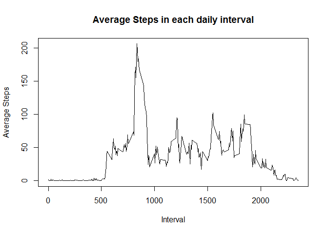
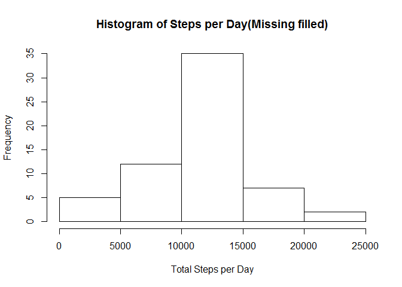
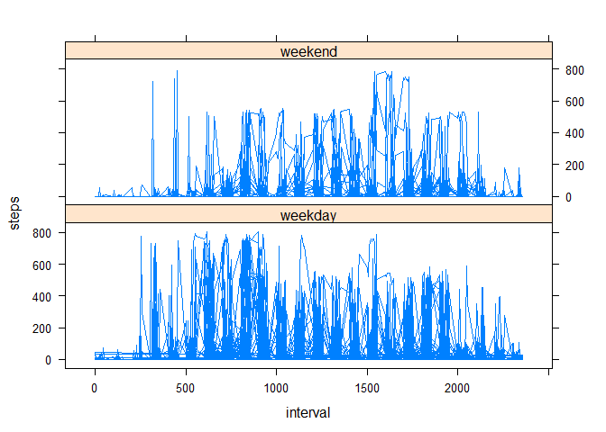

# Reproducible Research: Peer Assessment 1


## Loading and preprocessing the data

```r
        act<-read.csv("activity.csv",header=TRUE)
        require(lubridate)
```

```
## Loading required package: lubridate
```

```
## 
## Attaching package: 'lubridate'
```

```
## The following object is masked from 'package:base':
## 
##     date
```

```r
        act$date<-ymd(act$date)
```


## What is mean total number of steps taken per day?

```r
        require(dplyr)
```

```
## Loading required package: dplyr
```

```
## 
## Attaching package: 'dplyr'
```

```
## The following objects are masked from 'package:lubridate':
## 
##     intersect, setdiff, union
```

```
## The following objects are masked from 'package:stats':
## 
##     filter, lag
```

```
## The following objects are masked from 'package:base':
## 
##     intersect, setdiff, setequal, union
```

```r
        stperday<-group_by(act,date) %>% summarise(sum=sum(steps),mean=mean(steps),median=median(steps))
        #Compute mean and median
        mean(stperday$sum,na.rm=TRUE)
```

```
## [1] 10766.19
```

```r
        median(stperday$sum,na.rm=TRUE)
```

```
## [1] 10765
```

```r
        #plot histogram
        hist(stperday$sum,xlab="Total Steps per Day",main="Histogram of Steps per Day")
```

<!-- -->


## What is the average daily activity pattern?

```r
        interval<-group_by(act,interval) %>% summarise(avg=mean(steps,na.rm=TRUE))
        plot(interval$interval,interval$avg,type="l",xlab="Interval",ylab="Average Steps",
             main="Average Steps in each daily interval")
```

<!-- -->

```r
        #compute MAximum interval
        interval[which.max(interval$avg),1]
```

```
## # A tibble: 1 x 1
##   interval
##      <int>
## 1      835
```


## Imputing missing values

```r
        #total missing value rows
        sum(is.na(act$steps))
```

```
## [1] 2304
```

```r
        #impute missing values using MICE
        require(mice)
```

```
## Loading required package: mice
```

```r
        #remove date column(non-numeric), fill data using mice
        missing<-select(act,c(steps,interval))
        imputed<-mice(missing,m=1,maxit=5,method='pmm',seed=1)
```

```
## 
##  iter imp variable
##   1   1  steps
##   2   1  steps
##   3   1  steps
##   4   1  steps
##   5   1  steps
```

```r
        completeact<-cbind(act[,2],complete(imputed,1))
        names(completeact)[1]="date"
        #re-do steps calculations and histogram
        completestperday<-group_by(completeact,date) %>% summarise(sum=sum(steps),mean=mean(steps),median=median(steps))
        #Compute mean and median
        mean(completestperday$sum)
```

```
## [1] 11037.8
```

```r
        median(completestperday$sum)
```

```
## [1] 11352
```

```r
        #plot histogram
        hist(completestperday$sum,xlab="Total Steps per Day",main="Histogram of Steps per Day(Missing filled)")
```

<!-- -->


We see that by imputing the missing steps values, we have increased the mean and median values.


## Are there differences in activity patterns between weekdays and weekends?

```r
        tmp<-weekdays(completeact$date)=="Sunday" | weekdays(completeact$date)=="Saturday"
        completeact<-cbind(completeact,ifelse(tmp==TRUE,"weekend","weekday"))
        names(completeact)[4]="weekday"
        require(lattice)
```

```
## Loading required package: lattice
```

```r
        with(completeact,xyplot(steps~interval|weekday,type="l",layout=(c(1,2))))
```

<!-- -->
